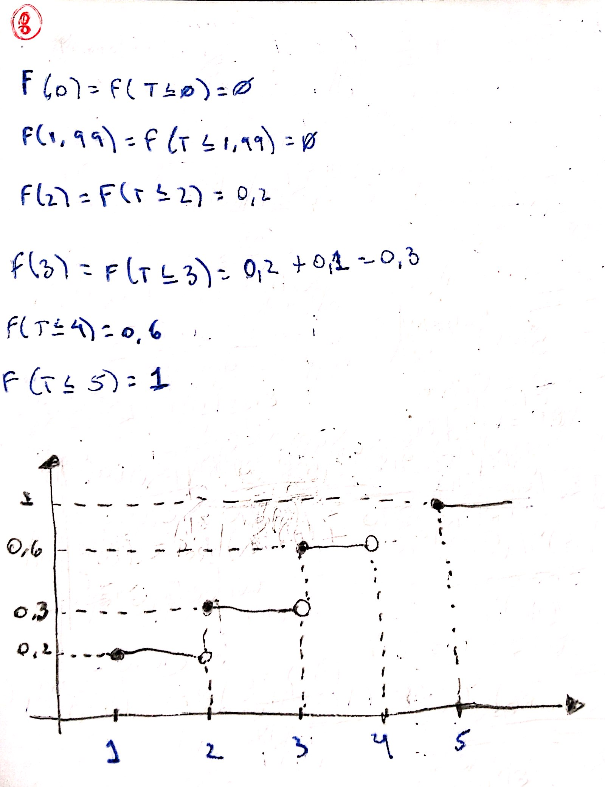

## Respostas Lista 1

#### Exercício 1)

    E1 = {1, 2, 3, 4, 5, 6}

    E2 = {0, 1, 2, 3, 4, 5}

    E3 = {1, 2, 3, .....}

    E4 = {t E R| t >= 0 }

    E5 = {h E R| 1,5 >= h <= 2,5 }

#### Exercício 2)

    E1 = {2, 4, 6 }

    E2 = {2}

    E3 = {5 ou mais vezes}

    E4 = {t >= 5h}

    E5 = {h > 2m}

#### Exercício 3)

    - Quantidade total de pessoas: 30
    - Aniversariantes: 2
    - Dias no ano: 365

    P(D) = Probabilidade das pessoas não fazerem aniversarios juntas

    P(C) = Probabilidade de alguem compartilhar o aniversarsio com pelo menos 1 pessoa

    P(C) = 1-P(D)

    P(D) = (365! / (365-30)!) / 365^30 =  0.2936838

    P(C) = 1 - 0.2936838 = 0.70

#### Exercício 4)

    Qual a chance da pessoa com teste positivo ter realmente o vírus?

    Fração de infectados = 1/1000 = 0,001

    Positivo-HIV = 0,95  
    Positivo-Sem-HIV = 1 - 95% = 0,05 

    Negativo-HIV = 1 - 98% = 0,02 
    Negativo-Sem-HIV = 0,98  

    A = Testou positivo  
    B = Tem HIV

    P(A|B) = P(B|A)P(A)/P(B)

    P(B|A) = 0,95
    P(A) = 0,001
    P(B) = (0,95 * 0,001) + (0,02 * 0,999)

    P(B|A)P(A)/P(B) = 0,95 * 0,001 / (0,95 * 0,001) + (0,02 * 0,999) = 0,00095/0,02093

    P(B|A)P(A)/P(B) = 0,0453

#### Exercício 5)

    3 moedas
    y = 'número de caras obtidas'

    k = cara
    z = coroa

    Espaço Amostral: {kzk, kzz, kkz, kkk, zzk, zkz, zkk, zzz}

Saída | y | Prob
:---------: | :------: | :-------:
kzk | 2 | 1/2 * 1/2 * 1/2 = 1/8
kzz | 1 | 1/2 * 1/2 * 1/2 = 1/8
kkz | 2 | 1/2 * 1/2 * 1/2 = 1/8
kkk | 3 | 1/2 * 1/2 * 1/2 = 1/8
zzk | 1 | 1/2 * 1/2 * 1/2 = 1/8
zkz | 1 | 1/2 * 1/2 * 1/2 = 1/8
zkk | 2 | 1/2 * 1/2 * 1/2 = 1/8
zzz | 0 | 1/2 * 1/2 * 1/2 = 1/8

X | 0 | 1 | 2 | 3 
:---------: | :------: | :-------:| :-------:| :-------:
P(Y = y) | 1/8 | 3/8 | 3/8  | 1/8

#### Exercício 6)

#### Exercício 7)

#### Exercício 8)

#### Exercício 9)

#### Exercício 10)
